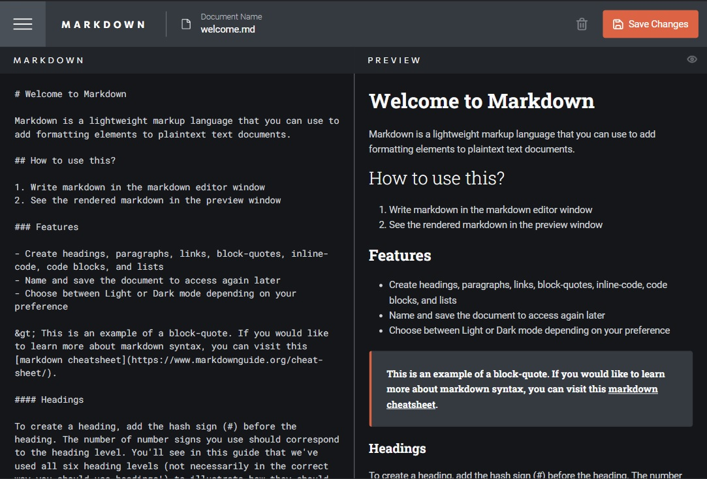
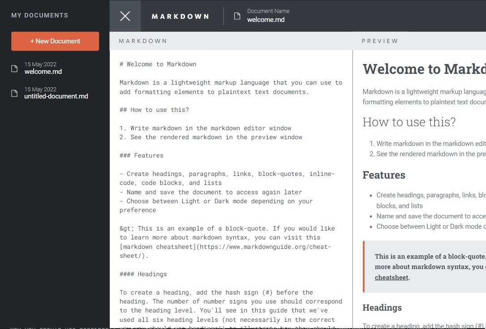

# Frontend Mentor - In-browser markdown editor solution

This is a solution to the [In-browser markdown editor challenge on Frontend Mentor](https://www.frontendmentor.io/challenges/inbrowser-markdown-editor-r16TrrQX9). Frontend Mentor challenges help you improve your coding skills by building realistic projects.

## Table of contents

- [Overview](#overview)
  - [The challenge](#the-challenge)
  - [Screenshot](#screenshot)
  - [Links](#links)
- [Built with](#built-with)
- [Author](#author)
- [Acknowledgments](#acknowledgments)

## Overview

### The challenge

Users should be able to:

- Create, Read, Update, and Delete markdown documents
- Name and save documents to be accessed as needed
- Edit the markdown of a document and see the formatted preview of the content
- View a full-page preview of the formatted content
- View the optimal layout for the app depending on their device's screen size
- See hover states for all interactive elements on the page
- Use localStorage to save the current state in the browser that persists when the browser is refreshed

### Screenshot

 

### Links

- Solution URL: [https://github.com/HarrisonPeace/in-browser-markdown-editor](https://github.com/HarrisonPeace/in-browser-markdown-editor)
- Live Site URL: [https://harrison-peace-markdown-editor.netlify.app/](https://harrison-peace-markdown-editor.netlify.app/)

## Built with

- Semantic HTML5 markup
- SCSS custom properties
- [Vue](https://vuejs.org/) - JS library
- [Pinia](https://pinia.vuejs.org/) - State management
- [Bootstrap](https://getbootstrap.com/) - For styles

## Author

- Website - [Harrison Peace](https://www.harrison-peace.com)
- LinkedIn - [harrison-peace](https://www.linkedin.com/in/harrison-peace/)

## Commands

### Project setup

```
yarn install
```

### Compiles and hot-reloads for development

```
yarn serve
```

### Compiles and minifies for production

```
yarn build
```

### Lints and fixes files

```
yarn lint
```
